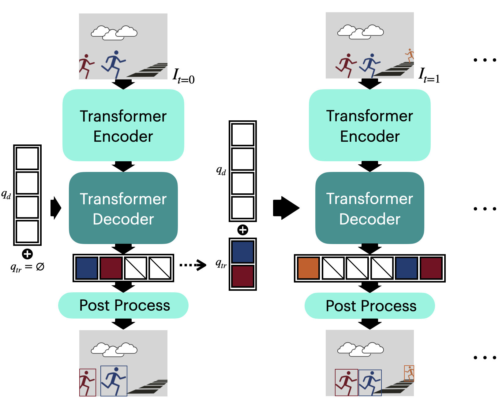

# MOTT: A New Model for Multi-Object Tracking Based on Green Learning Paradigm

This is the official implementation of MOTT paper, a novel multi-object tracking model.
The code is inspired
by [TrackFormer](https://github.com/timmeinhardt/trackformer), [TransTrack](https://github.com/PeizeSun/TransTrack),
[DETR](https://github.com/fundamentalvision/Deformable-DETR), [CSWin](https://github.com/microsoft/CSWin-Transformer)
by taking the effective Transformer components (CSWin Encoder, deformable DETR decoder) forming a new light-weighted
Transformer specialized in MOT.

**The paper is accepted and published in Journal AI Open. It is
available [here](https://www.sciencedirect.com/science/article/pii/S2666651023000165).**

<div align="center">
    
    
    
</div>

## Motivation

Multi-object tracking (MOT) is one of the most essential and challenging tasks in computer vision (CV). Unlike object
detectors, MOT systems nowadays are more complicated and consist of several neural network models. Thus, the balance
between the system performance and the runtime is crucial for online scenarios. While some of the works contribute by
adding more modules to achieve improvements, we propose a pruned model by leveraging the state-of-the-art Transformer
backbone model. Our model saves up to 62% FLOPS compared with other Transformer-based models and almost as twice as
fast as them. The results of the proposed model are still competitive among the state-of-the-art methods. Moreover, we
will open-source our modified Transformer backbone model for general CV tasks as well as the MOT system.

<div align="center">
   
</div>

## Installation

Please visit the [installation.md](docs/installation.md) for guidances.

## Training

Please visit the [dataset.md](docs/dataset.md) for dataset preparation. Then, head to the [train.md](docs/train.md) for
training scripts.

## Evaluation

### MOT Evaluation

We split the MOT17 dataset into two halves as shown in the paper, then we trained all models on the first half using the
same schedule and evaluated on the second half.

<center>

|    Model    | MOTA ↑ | MOTP ↑ | IDF1 ↑ | MT ↑ | ML ↓ |
|:-----------:|:------:|:------:|:------:|:----:|:----:|
| TransTrack  | 66.5%  | 83.4%  | 66.8%  | 134  |  61  |
| TrackFormer | 67.0%  | 84.1%  | 69.5%  | 152  |  57  |
|  **MOTT**   | 71.6%  | 84.5%  | 71.7%  | 166  |  41  |

</center>

### Other Datasets

We evaluated MOTT on the testing sets of MOT20 and DanceTrack in addition to MOT17.
The MOT17 and MOT20 results are obtained from the model trained by corresponding datasets,
while the DanceTrack results are derived from the MOT20 model without fine-tuning.

<center>

|  Dataset   | MOTA ↑ | MOTP ↑ | IDF1 ↑ | MT ↑  | ML ↓  |
|:----------:|:------:|:------:|:------:|:-----:|:-----:|
| DanceTrack | 85.4%  | 81.9%  | 33.7%  | 81.5% | 0.3%  |
|   MOT20    | 66.5%  | 81.1%  | 57.9%  | 52.1% | 13.8% |
|   MOT17    | 71.6%  | 84.5%  | 71.7%  | 49.0% | 12.1% |

</center>

### Computing Efficiency

Four models are compared in terms of the number of parameters (#Params), total CUDA time used, and averaged FLOPS.

<center>

|       Model       | #Params (M)↓ | CUDA time (s)↓ | Avg. FLOPS (G)↓ |
|:-----------------:|:------------:|:--------------:|:---------------:|
|    TransTrack     |     46.9     |      8.17      |     428.69      |
|    TrackFormer    |     44.0     |     13.67      |     674.92      |
| TrackFormer-CSWin |     38.3     |     16.26      |     714.83      |
|     **MOTT**      |     32.5     |      6.76      |     255.74      |

</center>

### Ablation Study

The ablation study shows the performance differences when gradually removing the components.
Notations: Res=ResNet50, CSWin=CSWin-tiny, DE=Deformable Encoder, DD=Deformable Decoder.

<center>

|         Modules         | MOTA ↑ | IDF1 ↑ | Hz ↑ |
|:-----------------------:|:------:|:------:|:----:|
| Res+DE+DD (TrackFormer) | 66.8%  | 70.7%  | 5.39 |
|       CSWin+DE+DD       | 72.7%  | 72.9%  | 4.73 |
|   CSWin+DD (**MOTT**)   | 71.9%  | 72.6%  | 9.09 |

</center>

### Test your own videos

1. Install and activate the Python environment.
2. Download the pre-trained weights `cswin_tiny_224.pth` and `mot17_ch_mott.tar.gz`
   from [OwnCloud](https://owncloud.ut.ee/owncloud/s/wppiGAgSHTxEdJ8).
3. Put `cswin_tiny_224.pth` in `./models` folder. Extract `mot17_ch_mott` folder and put it in `./models`
   folder.
4. Put the testing video (`.mov`, `.mp4`, `.avi` formats) in `./data/videos/` folder.
5. Run the command at the root of the repo:

```bash
python src/track_online.py
```

The program will show a list of available videos in the folder.
Select a video by inputting the index number.
Stop video by issuing key `q`.
Terminate the program by issuing `ctrl+c`.

The config file of the program is stored in `cfgs/track_online.yaml`.

### Evaluate on datasets

* The dataset should follow the same structure of MOT17, MOT20, or DanceTrack in order to evaluate it.
* You can find the configuration file at `cfgs/track_exp.yaml`.
    - `dataset_name` specifies the dataset to use. Check `src/trackformer/datasets/tracking/factory.py` for all
      available dataset options.
    - `obj_detect_checkpoint_file`: denotes the path for model checkpoint file.

After modified the configuration, start evaluation by running:

```bash
python src/track.py with exp
```

## Contributors

Shan Wu; Amnir Hadachi; Chaoru Lu, Damien Vivet.

## Citation

If you use MOTT in an academic work, please cite:

```
@article{wu2023mott,
  title={MOTT: A new model for multi-object tracking based on green learning paradigm},
  author={Wu, Shan and Hadachi, Amnir and Lu, Chaoru and Vivet, Damien},
  journal={AI Open},
  year={2023},
  publisher={Elsevier}
}
```

Published paper is [here](https://www.sciencedirect.com/science/article/pii/S2666651023000165).
